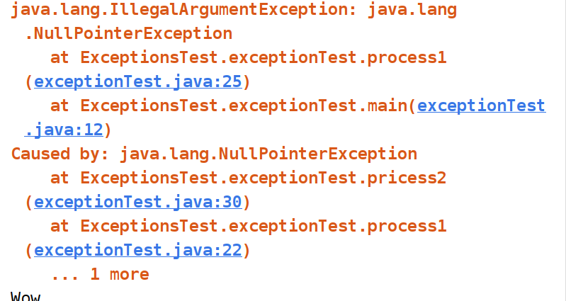

# 异常的传播

当某个方法抛出了异常时，如果当前方法没有捕获异常，异常就会被抛到上层调用方法，直到遇到某个`try ... catch`被捕获为止：

eg: main()方法调用process1()方法,process1()调用process2()方法，异常如果没有在process1()中被处理，最终层层往上传递，最会被抛给main()来处理

~~~
public class Main {
    public static void main(String[] args) {
        try {
            process1();
        } catch (Exception e) {
            e.printStackTrace();
        }
    }

    static void process1() {
        process2();
    }

    static void process2() {
        Integer.parseInt(null); // 会抛出NumberFormatException
    }
}

~~~


# 异常的捕获

父类异常会补货子类异常

* 在多个catch语句中，要把子类异常写在父类异常前面

# 抛出异常，可能在过程中导致的异常传递消失等处理


~~~
package ExceptionsTest;

/**
 * 涉及抛出异常的顺序
 *
 * @author datefate
 * @site create 2020-09-22-下午7:31
 */
public class exceptionTest {


    public static void main(String[] args) {
        try {
            process1();
        }catch (Exception e){
//            e.printStackTrace();
            throw new RuntimeException(e);
        }
        finally {
            System.out.println("Wow");
        }
    }
    static void process1(){
    try {
        pricess2();

    }catch (Exception e){
        throw  new IllegalArgumentException(e);

    }
    }
    static void pricess2(){
        throw new NullPointerException();
    }

}


~~~


异常抛出：




在`catch`中抛出异常，不会影响`finally`的执行。JVM会先执行`finally`，然后抛出异常：

但是，在finally 语句中抛出异常，catch中的异常会被屏蔽，见下面的**异常屏蔽**


在源代码中catch语句上加：`throw new RuntimeException(e);`


# Java标准库定义的常用异常


~~~
Throwable
|
|-----Error
|-----Exception
~~~


```ascii
Exception
│
├─ RuntimeException
│  │
│  ├─ NullPointerException
│  │
│  ├─ IndexOutOfBoundsException
│  │
│  ├─ SecurityException
│  │
│  └─ IllegalArgumentException
│     │
│     └─ NumberFormatException
│
├─ IOException
│  │
│  ├─ UnsupportedCharsetException
│  │
│  ├─ FileNotFoundException
│  │
│  └─ SocketException
│
├─ ParseException
│
├─ GeneralSecurityException
│
├─ SQLException
│
└─ TimeoutException
```

`Error`表示严重的错误，程序对此一般无能为力，例如：

- `OutOfMemoryError`：内存耗尽

- `NoClassDefFoundError`：无法加载某个Class

- `StackOverflowError`：栈溢出某些异常是应用程序逻辑处理的一部分，应该捕获并处理。例如：

  - `NumberFormatException`：数值类型的格式错误
  - `FileNotFoundException`：未找到文件
  - `SocketException`：读取网络失败

  还有一些异常是程序逻辑编写不对造成的，应该修复程序本身。例如：

  - `NullPointerException`：对某个`null`的对象调用方法或字段
  - `IndexOutOfBoundsException`：数组索引越界

`Exception`又分为两大类：

1. `RuntimeException`以及它的子类；
2. 非`RuntimeException`（包括`IOException`、`ReflectiveOperationException`等等）

Java规定：

- 必须捕获的异常，包括`Exception`及其子类，但不包括`RuntimeException`及其子类，这种类型的异常称为Checked Exception。
- 不需要捕获的异常，包括`Error`及其子类，`RuntimeException`及其子类。