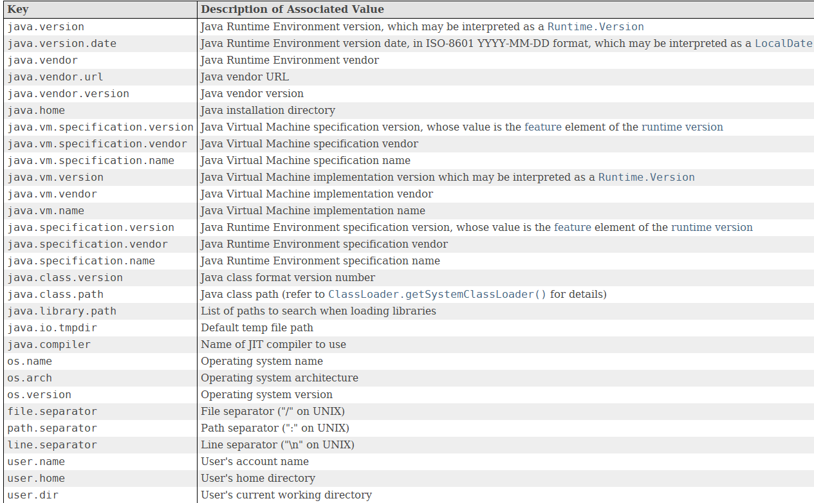

## 时间

在数据库中，我们需要存储的最常用的是时刻（`Instant`），因为有了时刻信息，就可以根据用户自己选择的时区，显示出正确的本地时间。所以，最好的方法是直接用长整数`long`表示，在数据库中存储为`BIGINT`类型。

- 一套定义在`java.util`这个包里面，主要包括`Date`、`Calendar`和`TimeZone`这几个类；( 兼容老代码时考虑，使用`Joda-Time`替代 )
- 一套新的API是在Java 8引入的，定义在`java.time`这个包里面，主要包括`LocalDateTime`、`ZonedDateTime`、`ZoneId`等。

`Joda-Time`是 java8 之前的 Java 事实上的标准日期和时间库。从 Java SE 8 开始，要求用户迁移到` java.time` (JSR-310)

```
<dependency>
  <groupId>joda-time</groupId>
  <artifactId>joda-time</artifactId>
  <version>2.12.5</version>
</dependency>
```

计算机表示的时间是以整数表示的时间戳存储的，即Epoch Time，Java使用`long`型来表示以毫秒为单位的时间戳，通过`System.currentTimeMillis()`获取当前时间戳。

`Date`对象有几个严重的问题：它不能转换时区，除了`toGMTString()`可以按`GMT+0:00`输出外，Date总是以当前计算机系统的默认时区为基础进行输出。此外，我们也很难对日期和时间进行加减，计算两个日期相差多少天，计算某个月第一个星期一的日期等。

`Calendar`只有一种方式获取，即`Calendar.getInstance()`，而且一获取到就是当前时间。如果我们想给它设置成特定的一个日期和时间，就必须先清除所有字段

## 系统信息



